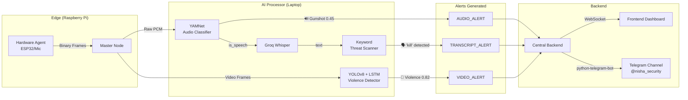

# Unified Alert & Intelligence System — Implementation Plan

Integrate all legacy `Nisha_eyes.py` capabilities into the new NISHA distributed architecture, with a **premium frontend alert experience** and **Telegram bot notifications** for critical events.

---

## Data Flow: Complete Alert Pipeline



---

## Confidence Thresholds — Preventing False Alerts

> [!IMPORTANT]
> **This is critical.** YAMNet can misclassify ambient sounds (e.g., a door slam as "Gunshot"). We use a **tiered confidence system** to prevent false positives while ensuring real threats are never missed.

### Audio Classification (YAMNet)

| Action | Confidence Required | Rationale |
|---|---|---|
| **Frontend full-screen overlay** | ≥ 0.30 | Show operator the alert; they can dismiss if false |
| **Frontend toast notification** | ≥ 0.20 | Low-priority visual notice |
| **Telegram alert** | ≥ 0.40 | Must be very confident before sending to external channel |
| **Consecutive confirmation** | 2 alerts in 5 seconds | Reduces single-frame false positives |

### Danger Class Severity Tiers

```
TIER 1 — CRITICAL (Immediate Telegram + Full-Screen Overlay):
  • Gunshot, gunfire
  • Machine gun / Fusillade / Artillery fire
  • Explosion
  • Screaming (only if confidence ≥ 0.50)

TIER 2 — HIGH (Telegram after consecutive detection + Toast):
  • Siren / Civil defense siren
  • Police car (siren) / Ambulance / Fire engine
  • Fire alarm / Smoke detector
  • Shatter (glass)

TIER 3 — MEDIUM (Toast only, no Telegram):
  • Alarm
  • Cap gun
```

### Video Violence Detection (LSTM)

| Action | Confidence Required |
|---|---|
| **Frontend overlay** | ≥ 0.70 |
| **Telegram alert** | ≥ 0.80 |
| **Alert feed entry** | ≥ 0.60 |

### Keyword Threat Detection (Transcriptions)

| Action | Condition |
|---|---|
| **Frontend toast** | Any violence keyword detected |
| **Telegram alert** | ≥ 2 keywords in single transcription, OR keyword + audio danger in 10s window |

---

## Frontend Alert Visualization

The dashboard will have **three layers** of alert visibility, ensuring the operator **never misses a critical event** regardless of which page they are on:

### Layer 1: Full-Screen Alert Overlay (Already Built — `AudioAlertOverlay.tsx`)

**Trigger:** TIER 1 audio events OR video violence ≥ 0.70

- 🔴 Pulsing red border around entire screen
- Central alert card with sound class, agent ID, confidence
- Expanding ring animation
- **ACKNOWLEDGE & DISMISS** button
- Auto-dismiss after 15 seconds
- **NEW**: Also shows for `VIDEO_VIOLENCE_EVENT` and `TRANSCRIPT_THREAT_EVENT`

### Layer 2: Toast Notifications (Sonner — already installed)

**Trigger:** TIER 2/3 audio events, keyword detections, lower-confidence alerts

- Slides in from top-center
- Color-coded by severity (red/amber/blue)
- Shows: icon + sound class + agent ID + confidence
- Auto-dismiss after 8 seconds
- Clickable to navigate to Alert Center

### Layer 3: Persistent Alert Feed (`/dashboard/alerts` page)

**Trigger:** ALL alert events are logged here

- Existing `AlertCenterPage` — currently shows audio/video events from DB
- **NEW**: Will also receive real-time WebSocket alerts
- Filterable by type: 🔊 Audio | 🎥 Video | 🗣️ Transcript
- Each alert shows: severity badge, description, agent, zone, timestamp, acknowledge button

### Layer 4: Audio Intelligence Panel Enhancement

**Trigger:** Transcription + keyword detection

- **NEW**: Highlight transcriptions containing violence keywords in red
- **NEW**: Show a "⚠️ THREAT DETECTED" badge next to flagged transcriptions
- Shows translated text alongside original (when TigoGroq is available)

### Dashboard Overview KPI Cards

- **"Active Alerts" KPI** — already exists, will update in real-time as alerts flow in
- **"Threat Level" indicator** — already in store (`threatLevel`), driven by alert severity

---

## Proposed Changes

---

### AI Audio Processor

#### [MODIFY] [audio_classifier.py](file:///home/nisha/Desktop/NISHA/ai/audio_processor/audio_classifier.py)
- Add severity tier classification (`TIER_1_CRITICAL`, `TIER_2_HIGH`, `TIER_3_MEDIUM`)
- Add consecutive-detection buffer to reduce false positives (2 detections in 5s)
- Return tier + severity alongside class name and confidence

#### [MODIFY] [main.py](file:///home/nisha/Desktop/NISHA/ai/audio_processor/main.py)
- **Keyword Threat Scanner**: After Whisper returns transcription text, scan for violence keywords (ported from `Nisha_eyes.py`)
- Send `TRANSCRIPT_ALERT` message when keywords are found (alongside existing `PARTIAL_TRANSCRIPT`)
- Include `severity` field in `AUDIO_ALERT` payload based on tier classification
- Only emit alerts when confidence exceeds the tier-specific threshold

---

### Master Node

#### [MODIFY] [agent_ws.py](file:///home/nisha/Desktop/NISHA/masters/src/nisha_master/interfaces/agent_ws.py)
- Handle new `TRANSCRIPT_ALERT` message type from AI Processor
- Relay `TRANSCRIPT_ALERT` as LITE frame to Backend (same pattern as `AUDIO_ALERT`)

---

### Central Backend

#### [MODIFY] [connection_manager.py](file:///home/nisha/Desktop/NISHA/Backend/src/nisha/infrastructure/websocket/connection_manager.py)
- Handle `TRANSCRIPT_ALERT` in LITE frame processing → broadcast `TRANSCRIPT_THREAT_EVENT` to frontend
- Handle `VIDEO_VIOLENCE` in LITE frame processing → broadcast `VIDEO_VIOLENCE_EVENT` to frontend

#### [NEW] [telegram_service.py](file:///home/nisha/Desktop/NISHA/Backend/src/nisha/services/telegram_service.py)
- Centralized Telegram Bot service using `python-telegram-bot`
- Methods: `send_audio_alert()`, `send_video_alert()`, `send_transcript_alert()`
- Rate limiting: max 1 Telegram alert per agent per 30 seconds (prevent spam)
- Configurable via environment variables (`TELEGRAM_BOT_TOKEN`, `TELEGRAM_CHAT_ID`)

#### [MODIFY] [main.py](file:///home/nisha/Desktop/NISHA/Backend/src/nisha/main.py)
- Initialize `TelegramService` on startup
- Wire it into the connection manager so alerts trigger Telegram notifications

---

### React Frontend

#### [MODIFY] [types/index.ts](file:///home/nisha/Desktop/NISHA/Frontend/src/types/index.ts)
- Add `TRANSCRIPT_THREAT_EVENT` and `VIDEO_VIOLENCE_EVENT` to `WebSocketMessageType` enum

#### [MODIFY] [DataLoader.tsx](file:///home/nisha/Desktop/NISHA/Frontend/src/components/dashboard/DataLoader.tsx)
- Subscribe to `TRANSCRIPT_THREAT_EVENT` → trigger toast + add to alerts store
- Subscribe to `VIDEO_VIOLENCE_EVENT` → trigger full-screen overlay + add to alerts store
- Add Sonner toast calls for TIER 2/3 audio alerts (instead of full-screen overlay)

#### [MODIFY] [AudioAlertOverlay.tsx](file:///home/nisha/Desktop/NISHA/Frontend/src/components/dashboard/AudioAlertOverlay.tsx)
- Support multiple alert types (audio, video, transcript) with different styling:
  - 🔴 **Audio danger**: Red theme (current design)
  - 🟣 **Video violence**: Purple theme with camera icon
  - 🟠 **Transcript threat**: Orange theme with speech icon
- Show severity tier badge

#### [MODIFY] [AudioIntelligence.tsx](file:///home/nisha/Desktop/NISHA/Frontend/src/components/dashboard/AudioIntelligence.tsx)
- Highlight transcriptions containing violence keywords with red background + ⚠️ badge
- Show keyword matches inline

#### [MODIFY] [store/useStore.ts](file:///home/nisha/Desktop/NISHA/Frontend/src/store/useStore.ts)
- Extend `activeAudioAlert` to support `alertCategory: 'audio' | 'video' | 'transcript'`
- Add `removeAgent` implementation (missing but declared in interface)

---

## Open Questions

> [!WARNING]
> ### 1. TigoGroq Translation Module
> The `source.TigoGroq` module from the old project is not in the current codebase. Do you have this module available to port? If so, where is it located? If not, we can use the Groq LLM API directly for translation (since Groq is already a dependency).

> [!IMPORTANT]
> ### 2. Telegram Bot Credentials
> The old `Nisha_eyes.py` has a hardcoded bot token. Should we:
> - **A)** Use the same bot token from the old project (move to `.env`)
> - **B)** Create a new bot for the distributed system

> [!IMPORTANT]
> ### 3. Video Violence Detection — Where to Run?
> The YOLOv8 + LSTM pipeline is compute-heavy. Options:
> - **A)** Run on the **AI Processor laptop** alongside YAMNet (add a `/stream/video/{agent_id}` endpoint)
> - **B)** Run on the **Backend** (current `_handle_video_clip` tries to call an AI processor but none is wired)
> - **C)** Run as a **separate service** on the laptop

> [!NOTE]
> ### 4. Alert Sound Effect
> Should the frontend play an audible alarm sound (siren/beep) when a critical alert appears? This would make it impossible to miss.

---

## Verification Plan

### Automated Tests
1. Play a gunshot audio clip near the hardware mic → verify:
   - AI Processor logs `NISHA ALERT: Gunshot, gunfire (≥0.40)`
   - Backend logs `BACKEND BROADCASTING AUDIO_ALERT`
   - Frontend shows full-screen red overlay
   - Telegram channel receives alert message
2. Speak violence keywords ("shoot", "kill") → verify:
   - Whisper transcribes correctly
   - Keyword scanner flags the text
   - Frontend shows orange toast
   - Telegram receives transcript alert
3. Stream a violence video clip → verify:
   - LSTM classifies as Violence (≥0.70)
   - Frontend shows purple violence overlay
   - Telegram receives video alert

### Manual Verification
- Verify false positive rate by running normal conversation + ambient sounds for 5 minutes
- Confirm no spurious Telegram messages are sent during normal operation
